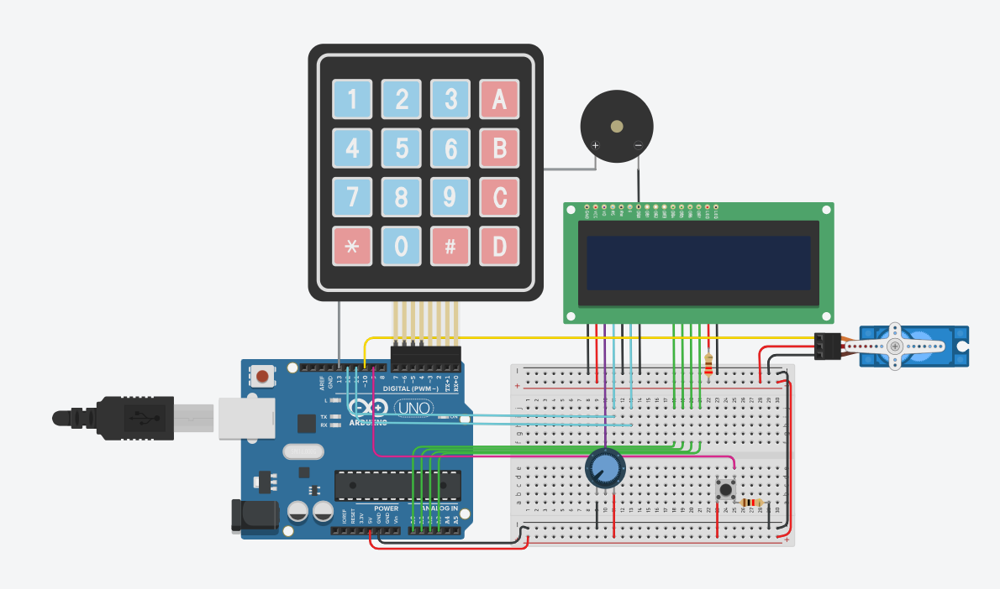

Projeto: Sistema de Porta Automática com Senha
==========================================================

Descrição do Projeto
--------------------

Este projeto implementa um sistema de porta automática com senha utilizando o ambiente de simulação Tinkercad. A ideia por trás desse projeto é criar uma solução que possa ser aplicada em portas automáticas de hospitais, garantindo a segurança de salas e locais de acesso restrito.

Link do Projeto
--------------------
Clique neste [Link](https://youtu.be/13VdM_EoaAA?si=jXi-zB9MbM8UFXGw) para acessar o vídeo de apresentação do projeto  
Clique neste [Link](https://www.tinkercad.com/things/eaxdHwMSo2a-gs-edge-computing) para conhecer o projeto no Tinkercad

Funcionalidades
---------------

1.  Cadastro de Senha:

    -   O sistema permite cadastrar uma senha que será associada à porta.
2.  Travamento Automático:

    -   Após cadastrar a senha, a porta fica automaticamente trancada, impedindo o acesso não autorizado.
3.  Desbloqueio com Senha:

    -   Ao digitar a senha correta, a porta se destranca, permitindo o acesso.
4.  Segurança Hospitalar:

    -   O projeto tem como objetivo proporcionar uma solução segura para hospitais, garantindo que apenas pessoal autorizado possa acessar determinados locais.

Componentes Utilizados
----------------------

O projeto no Tinkercad utiliza os seguintes componentes:

-   Arduino 
-   Micro Servo (representando o mecanismo de abertura da porta)
-   Teclado de membrana (para entrada da senha)
-   Buzzer (toca à cada interação com o o teclado)

Instruções de Uso
-----------------

1.  Cadastro de Senha:

    -   No início, o usuário deve cadastrar uma senha utilizando o teclado numérico.
2.  Travamento Automático:

    -   Após o cadastro da senha, a porta será automaticamente trancada.
3.  Desbloqueio:

    -   Para desbloquear a porta, digite a senha correta no teclado numérico.
4.  Comandos Basícos:

    -   Para confirmar a senha digitada, tecle "A".
    -   Para cancelar a senha digitada, tecle "B".

Integrantes
-----------------

Thiago Araujo RM 553477
 
Felipe Schneider RM 552643
